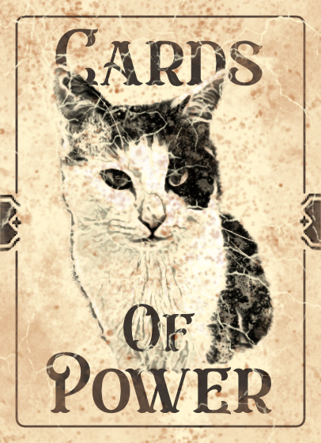
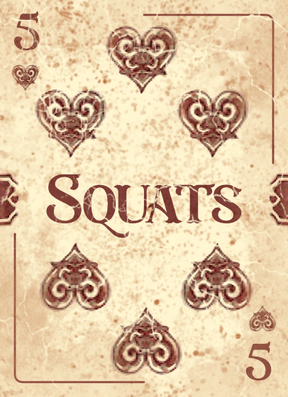
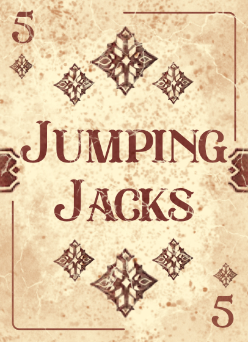
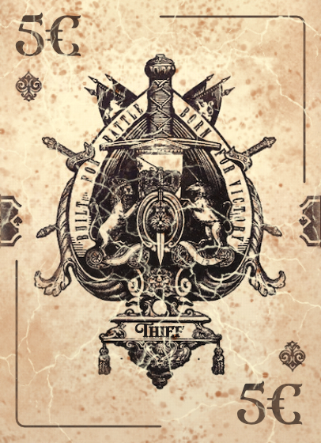
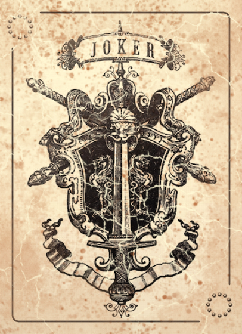
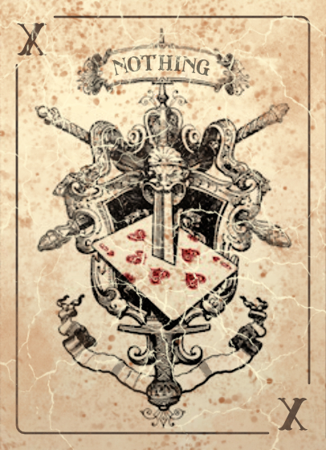

# Cards-Of-Power

Cards Of Power ist ein Spiel, bei dem eine zufällige Karte umgedreht wird.

Umdrehen kann man mit <code>strg</code> + <code>F9</code> und zurücksetzen mit <code>strg</code> + <code>F10</code>.

 
Das Ergebnis wird dann links in der Tabelle angezeigt wird. Ganz oben in der Tabelle wird die Anzahl angezeigt, wie oft man schon gedreht hat.

 

## Karten Design

